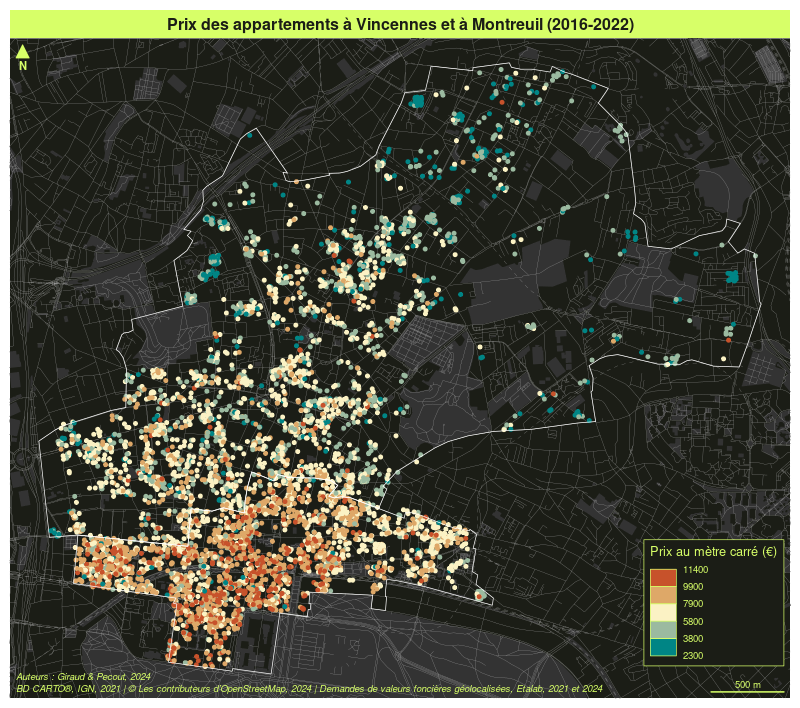
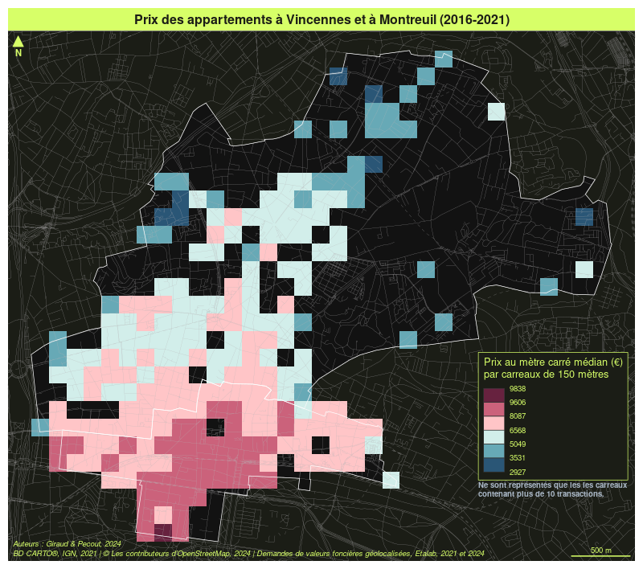

# Évalutation du cours "Géomatique et cartographie avec R" 

## Analyse des prix de l’immobilier à Vincennes et Montreuil 

*Timothée Giraud & Hugues Pecout*

### Présentation et préparation de l’espace de travail (4 points)

Vous devez tout d’abord télécharger le projet **exo_carto_2022** sur votre
machine puis le dézipper.  

Vous devez ensuite renommer le fichier **NOM_Prenom.R** avec vos propres
noms et prénoms.  
C’est ce fichier et uniquement ce fichier</u> que vous devrez nous envoyer
avant le **x février 2022**.  

Assurez vous bien que le script fonctionne avant de nous envoyer le
fichier. Pour cela vous pouvez relancer votre session R (ctrl+shift+F10) puis
relancer le script.

Vous devez apporter un soin particulier à la présentation du code. Il
doit être lisible aéré et commenté.

Vous devrez également soigner la présentation des cartes. Faites attention à 
l'othographe et n'oubliez pas les éléments d'habillage nécessaires. 

### Importer les couches d’information et les cartographier (4 points)

Pour ce devoir vous utiliserez les données du fichier **dvf.gpkg**
contenu dans le dossier **data** du projet **exo_carto_2022**.  
Ce fichier geopackage contient 5 couches d’information :

-   **com**, les limites communales de Vincennes (94) et de
    Montreuil (93) (BD CARTO®, IGN, 2021),
-   **parc**, les espaces verts de la région étudiée (© les
    contributeurs d’OpenStreetMap, 2021),
-   **route**, le réseau viaire de la région étudiée (© les
    contributeurs d’OpenStreetMap, 2021),
-   **rail**, le réseau ferré de la région étudiée (© les contributeurs
    d’OpenStreetMap, 2021),
-   **apt**, un extrait des appartements vendus entre 2016 et 2021 dans
    les communes de Vincennes et de Montreuil (Demandes de valeurs
    foncières géolocalisées, Etalab, 2021).

Vous produirez une carte de la région étudiée en utilisant toutes les
couches d’information disponibles.  
Vous devez exporter la carte dans une figure ayant une largeur de 800
pixels.   
Attention nous ne demandons pas la carte elle-même, uniquement
le code qui a servi à la produire.</u>

Sur cette carte vous devez faire figurer les limites communales de
Vincennes et de Montreuil, les espaces verts, le réseau viaire, le
réseau ferré et les positions des appartements vendus entre 2016 et
2021. Vous devrez ajouter à cette carte un habillage complet (fleche
d’orientation, echelle, titre, sources…).

### Carte des prix de l’immobilier (4 points)

Créer une carte ou chaque bien vendu apparait sous la forme d’un point
coloré en fonction de son prix.  
Exportez cette carte en PNG avec une largeur de 800 pixels.   
Attention nous ne demandons pas la carte elle-même, uniquement
le code qui a servi à la produire.</u>  
Vous devrez justifier la méthode de discrétisation que vous utilisez.

### Prix de l’immobilier dans le voisinnage de la Mairie de Montreuil (4 points)

Quel est le prix médian du mètre carré dans les 500 mètres autour de la mairie 
de Montreuil (coordonnées WGS84 : Y=48.8624, X=2.4410)? 

### Utilisation d’un maillage régulier (4 points)

Créez un maillage régulier de carreaux de 250 mètres de côté sur les
communes étudiées.  
Comptez le nombre de transaction dans chacun des carreaux.  
Calculez le prix médian au mètre carré par carreau.  
Construire un carte représentant le prix médian par carreau en
n’affichant que les carreaux ayant plus de 10 transactions.  
Exportez cette carte en PNG avec une largeur de 800 pixels.  
Attention nous ne demandons pas la carte elle-même, uniquement
le code qui a servi à la produire.</u>  
Justifiez la discrétisation utilisée.

